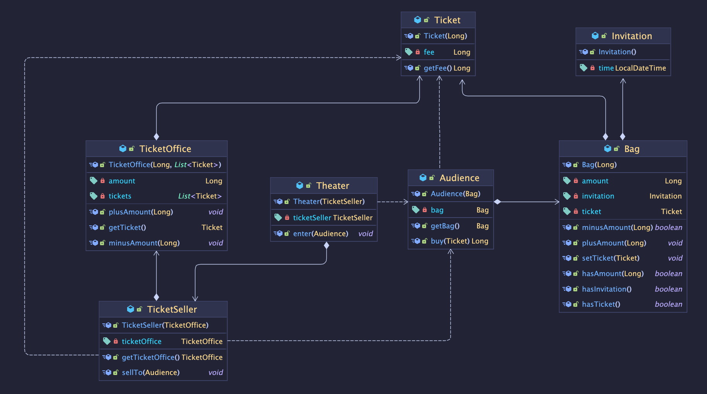

# 오브젝트 정리

## 1️⃣ 객체, 설계

> 객체지향 프로그램을 설계하고 유지보수 하기 위해서 실무, 즉 코드 자체에 초점을 맞출 것이다.
> 직접 만들어 보며 배우기!

- 애플리케이션의 핵심 클래스
  
  
    - 이 코드의 문제점
- Theater가 Audience의 Bag와 TicketSeller의 TicketOffice에 직접 접근한다. 

  = Theater가 Audience와 TicketSeller에 결합된다.

  = 객체가 자율적이지 않고 수동적이다.
  
→ Audience와 TicketSeller가 스스로 자신의 데이터를 관리하도록 한다. 자율적인 존재로 만들자.

- 🌟 **캡슐화** : 외부에는 메서드라는 API (인터페이스)만 제공하고, 내부의 구현은 숨기자.
  - TicketSeller는 sellTo() 메서드만 제공
  - Audience는 buy() 메서드만 제공

  장점
  - TicketSeller.sellTo(), Audience.buy()의 내부 구현을 변경해도 Theater에는 아무 지장이 없다.
  - TicketSeller, Audience 객체의 자율성을 높였다. 유연한 설계 & 객체의 응집도 향상
  > 응집도가 높다 
  > 
  > = 밀접하게 연관된 작업만 수행하고 연관성 없는 작업은 다른 객체에게 위임한다.
  >              
  > = 자신의 데이터를 스스로 책임진다. (처리한다.)

<aside>
💡 객체지향적으로 좋은 설계
  
- 높은 응집도

- 낮은 결합도

이를 위해선 불필요한 의존성은 제거하여 최소한의 의존성만 남겨야 한다.
</aside>

- Bag의 hold() 메서드와 TicketOffice의 sellTicketTo() 메서드를 구현함으로써 더 응집도 높고 자율적인 객체들로 만들었다. 
  
  
  💥근데 그 결과, Audience에 대한 의존성이 더 추가되어 결합도가 높아졌다.
    훌륭한 설계는 적절한 트레이드 오프의 결과물이다.

- 결론 : 휼륭한 객체지향 설계란
  - 협력하는 객체 사이의 의존성을 적절히 관리하는 설계
    - 최소한의 의존성만 남기다보면, 어느 순간 높은 응집도-높은 결합도 🆚 낮은 응집도-낮은 결합도 사이에서 적절한 균형을 찾아야 한다.
    - 적절한 의존성 = 적절한 객체에게 적절한 책임을 할당한 설계
  - 모든 객체들이 자율적으로 행동하는 설계 (객체들을 생물로 보기)
    - 이러한 측면에서 우리가 생각했던 대로 객체가 행동하기 때문에 보다 이해하기 쉬운 코드가 된다.
  - 변경에 유연하게 대응할 수 있는 설계
    - 구현은 숨기고 인터페이스만 제공하기 때문에 변경에 용이하다.

## 2️⃣ 객체지향 프로그래밍
용어 정리

- 영화 (Movie) = 영화 정보
- 상영 (Screening) = 실제 관객들이 영화를 관람하는 사건. 실제 예매 대상
- 할인 조건 = 할인 여부 결정 (할인 O/X)
- 할인 정책 = 할인 요금 결정 (얼마 할인)

  1개의 Movie는 하나의 할인 정책만 갖는다.

  1개의 Screening은 하나의 할인 조건만 갖는다.

