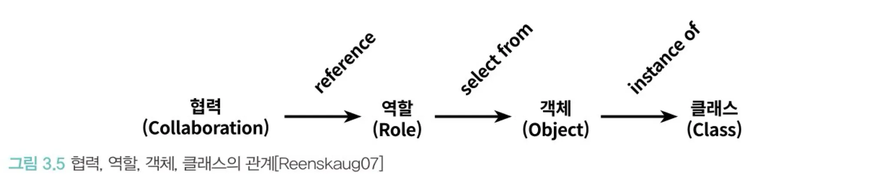

# 오브젝트 정리

## 1️⃣ 객체, 설계

#### [예제 코드 : 초대권 유무에 따라 티켓을 다르게 발행하는 시스템](./code/src/main/java/theater)

> 객체지향 프로그램을 설계하고 유지보수 하기 위해서 실무, 즉 코드 자체에 초점을 맞출 것이다.
> 직접 만들어 보며 배우기!

- 애플리케이션의 핵심 클래스
  
  
    - 이 코드의 문제점
- Theater가 Audience의 Bag와 TicketSeller의 TicketOffice에 직접 접근한다.

  = Theater가 Audience와 TicketSeller에 결합된다.

  = 객체가 자율적이지 않고 수동적이다.

→ Audience와 TicketSeller가 스스로 자신의 데이터를 관리하도록 한다. 자율적인 존재로 만들자.

- 🌟 **캡슐화** : 외부에는 메서드라는 API (인터페이스)만 제공하고, 내부의 구현은 숨기자.
    - TicketSeller는 sellTo() 메서드만 제공
    - Audience는 buy() 메서드만 제공

  장점
    - TicketSeller.sellTo(), Audience.buy()의 내부 구현을 변경해도 Theater에는 아무 지장이 없다.
    - TicketSeller, Audience 객체의 자율성을 높였다. 유연한 설계 & 객체의 응집도 향상
  > 응집도가 높다
  >
  > = 밀접하게 연관된 작업만 수행하고 연관성 없는 작업은 다른 객체에게 위임한다.
  >
  > = 자신의 데이터를 스스로 책임진다. (처리한다.)

<aside>
💡 객체지향적으로 좋은 설계

- 높은 응집도

- 낮은 결합도

이를 위해선 불필요한 의존성은 제거하여 최소한의 의존성만 남겨야 한다.
</aside>


- Bag의 hold() 메서드와 TicketOffice의 sellTicketTo() 메서드를 구현함으로써 더 응집도 높고 자율적인 객체들로 만들었다.
  

  💥근데 그 결과, Audience에 대한 의존성이 더 추가되어 결합도가 높아졌다.
  훌륭한 설계는 적절한 트레이드 오프의 결과물이다.

- 결론 : 휼륭한 객체지향 설계란
    - 협력하는 객체 사이의 의존성을 적절히 관리하는 설계
        - 최소한의 의존성만 남기다보면, 어느 순간 높은 응집도-높은 결합도 🆚 낮은 응집도-낮은 결합도 사이에서 적절한 균형을 찾아야 한다.
        - 적절한 의존성 = 적절한 객체에게 적절한 책임을 할당한 설계
    - 모든 객체들이 자율적으로 행동하는 설계 (객체들을 생물로 보기)
        - 이러한 측면에서 우리가 생각했던 대로 객체가 행동하기 때문에 보다 이해하기 쉬운 코드가 된다.
    - 변경에 유연하게 대응할 수 있는 설계
        - 구현은 숨기고 인터페이스만 제공하기 때문에 변경에 용이하다.

## 2️⃣ 객체지향 프로그래밍

#### [예제 코드 : 영화 예매 시스템](./code/src/main/java/reservation)

용어 정리

- 영화 (Movie) = 영화 정보
- 상영 (Screening) = 실제 관객들이 영화를 관람하는 사건. 실제 예매 대상
- 할인 조건 = 할인 여부 결정 (할인 O/X)
- 할인 정책 = 할인 요금 결정 (얼마 할인)

  1개의 Movie는 하나의 할인 정책만 갖는다.

  1개의 Screening은 하나의 할인 조건만 갖는다.


- **객체지향 설계 순서**
    1. 클래스(x) 객체(o) 에 초점을 맞추자!!!

       어떤 객체가 필요한지 고민하자.

       추상적인 것(클래스)이 아니라 구체적인 것(객체)를 먼저 결정해야 한다.

    2. 객체를 독립적인 존재가 아니라, 협력하는 공동체의 일원으로 봐야 한다.

       객체들 간의 협력을 고민하자.

    3. 객체들의 윤곽이 잡히면, 객체들의 공통된 특성, 상태끼리 분류하여 추상화하자! = 클래스 구현


- 캡슐화 : 데이터와 기능을 묶어 하나의 객체에 넣음

  캡슐화 + 접근 제어자 → public 메서드를 통해서만 내부 상태를 변경할 수 있음 (내부/외부 구분)

  → 객체의 자율성 보장, 구현의 자유 보장

  외부에는 인터페이스만 제공하고 내부 구현은 감춤으로써 변경에 대한 파급효과를 제어한다.


- Money라는 객체를 만든 이유

  long 타입 데이터를 쓸 수도 있지만, 이것은 금액과 관련되어 있다는 의미를 전달할 수 없다.

  Money 객체를 사용하면 도메인의 의미를 좀 더 명시적이고 풍부하게 표현할 수 있다. (설계의 명확성⬆️, 유연성⬆️)


- 생성자를 사용하여 초기화에 필요한 정보들을 강제하면, 올바른 객체 생성을 보장할 수 있다.


- 코드의 의존성과 실행 시점의 의존성이 다를 수 있다.
    - 장점 : 재사용성⬆️, 확장 가능성⬆️, 유연한 설계
    - 단점 : 가독성⬇️, 이해하기 어려움

  ⇒ 트레이드 오프


- **추상화**의 장점
    - 요구사항을 더 높은 수준에서 서술할 수 있다.

      더 쉽고 간단하게 표현할 수 있다.

    - 설계가 더 유연해진다.

      새로운 기능을 쉽게 추가하고 확장할 수 있다.

      OCP : 변경에 닫혀있고, 확장에 열려있다.

      DIP : 구체적인 것에 의존하지 않고, 추상적인 것에 의존한다.

### 다형성

메서드 호출 ≠ 메세지 전송

ex. A 객체가 B객체의 b.run() 호출

- B 객체는 외부 객체에게 run() 이라는 인터페이스를 제공한다.
- A 객체를 포함함 외부 객체들은 run() ~~메서드를 호출한다.~~  메시지를 전송한다.

  A 객체는 누가 이 요청을 처리하는 지는 관심이 없다. 오직 ‘내가 보낸 메시지를 처리할 수 있는가’ 에만 관심이 있다. 그래서 B가 요청을 처리하든, B의 자식이 요청을 처리하든 상관X

  그래서 부모 클래스 대신 자식 클래스를 사용하는 것이 가능하다.

  = 외부 객체는 부모 클래스와 자식 클래스를 동일한 타입으로 간주한다.

  = 업캐스팅 (자식이 부모 자리를 대신하는 것)

> **다형성** : 똑같은 메시지를 보냈을 때, 객체의 타입에 따라 다르게 응답할 수 있는 능력
>

- 똑같은 메시지를 보냈지만, 어떤 메서드가 실행될 지는 메시지를 수신하는 객체의 클래스가 무엇이냐에 따라 달라진다.

  ex. 똑같은 `getDiscountAmount()` 메서드를 실행했지만, `Movie`가 어떤 `DiscountPolicy` 구현체를 가지고 있는가에 따라 다른 금액이 반환된다.

- 모든 다형성에서 실행될 메서드는 컴파일 시점이 아닌 실행 시점에 결정된다. (동적 바인딩, 지연 바인딩)


- **다형성 구현 방법**

  상속과 합성의 공통점 = 코드를 재사용하기 위한 방법

    - **상속**
        - 자식 클래스는 부모 클래스가 제공하는 모든 인터페이스를 물려받을 수 있다.
        - 단점
            - 캡슐화를 위반한다. (부모의 구현이 자식에게 노출된다.)
            - 설계를 유연하지 못하게 만든다. (컴파일 시점에 상속 관계가 결정되어 실행 시점에 바꿀 수 없다)
    - **합성**
        - 인터페이스에 정의된 메시지를 통해서만 코드를 재사용하는 방식이다.

          → 구현을 캡슐화할 수 있다.

          → 메시지를 통해 느슨하게 결합된다.

  ⇒ 결론: 코드를 재사용하기 위해서는 합성을 사용하는 게 좋음.

  다형성을 위해서는 둘을 조합해서 사용해야 한다.

### 추상 클래스 🆚 인터페이스 트레이드오프

- DiscountPolicy를 추상클래스로 구현하여 상속을 사용한 경우

  

- DiscountPolicy를 인터페이스로 구현하여 구현을 사용한 경우

  

→ 이상적으로는 인터페이스를 사용한 설계가 더 좋아야 하지만, 실제로는 더 복잡하다.

    ❗구현과 관련된 모든 것들은 트레이드오프의 대상이 될 수 있다.
    
    따라서 내가 작성하는 모든 코드에는 아무리 사소한 결정이라도 합당한 이유가 있어야 한다.

    항상 고민하고 트레이드오프 하자❗

## 3️⃣ 역할, 책임, 협력

> 객체지향 설계의 핵심 = 객체들에게 적절한 책임을 할당하는 것
>

### 1. 협력

> 객체들이 애플리케이션의 기능을 구현하기 위해 수행하는 **상호작용**
>

- 애플리케이션 제어 흐름이 한 객체에 의해 통제되지 않고, 여러 객체들에게 균형 있게 분배되어야 한다.
- 책임이 모여 역할을 구성하고, 역할이 모여 협력이 완성된다.
- 협력에서 유일한 커뮤니케이션 수단이 바로 **메시지** 전송이다.

  **메서드 호출**이 아니라 **메시지 전송**이라 해야 하는 이유

  A 객체가 B 객체의 메서드를 호출한다. (x)

  A 객체가 B 객체에게 메시지를 전송하면 → B 객체가 메시지를 수신하여, 자신의 메서드를 실행한다 → 응답을 반환한다. (o)

  ⇒ 결론 : 메시지를 어떻게 처리할지는 A 객체가 아니라, 메시지를 수신한 B 객체가 직접 결정한다.


- 캡슐화 = 인터페이스만 제공하고, 내부 구현을 숨긴다.
    - 외부적으로 변경을 최소화 한다는 장점이 있고,
    - 내부적으로 이 객체의 자율성을 높인다는 장점이 있다.

1. 협력 = 요청 메시지를 보내는 것부터 시작한다.
2. 객체의 행동은 협력, 객체의 상태는 행동에 의해 결정된다.

   (객체가 협력 안에서 처리해야 하는 메시지 → 행동을 결정)

   ex. 객체가 aa 협력 안에서 bb라는 메시지를 처리해야 한다면 cc라는 행동을 해야해! → `행동`

   ex. 객체가 cc라는 행동을 하는 데 dd라는 정보가 필요해! → `상태`

   결론 : 행동과 상태 모두 협력에 의해 결정된다.

### 책임

> 각 객체에게 적절한 책임을 할당해야 한다.
>

- 책임의 종류
    - 하는 것 (doing)
    - 아는 것 (knowing)
        - 자신의 책임을 수행하는 데 필요한 정보를 아는 것
        - 내가 할 수 없는 일을 대신 해줄 객체를 아는 것

객체 지향 설계 🔄자율적인 객체들의 협력

- 객체들에게 적절한 책임을 할당해야 한다.

**책임 주도 설계 (Responsibility-Driven Design, RDD)**

> 적절한 책임을 할당하는 방법
>

1. ‘협력’ 이라는 문맥을 정의하자.

   = use-case 하나를 하나의 협력(책임)으로 보자.

2. 시스템의 책임을 더 작은 책임으로 쪼개자.
3. 쪼갠 책임들을 객체들에게 적절이 할당하자.
    1. 메시지의 이름을 결정
    2. 메시지를 처리할 적절한 객체를 선택한다.

       (메시지를 처리할 적절한 역할을 찾고 → 그 역할을 수행할 객체를 선택한다.)

        - 기본 전략 : 정보 전문가에게 책임을 할당한다. (= 자율적인 객체를 만드는 방법)
        - 예외 전략 : 응집도와 결합도를 개선하기 위해서 정보 전문가가 아닌 다른 객체에게 책임을 할당하기도 한다.
    3. 만약 3-1번에서 정해진 객체가 모르는 정보가 있다면, 관련 책임을 다른 전문가 객체에게 할당한다.

- A → B 객체에게 메시지 전송

  A가 수신하는 메시지가 B 객체의 책임을 결정한다.

  책임을 할당함으로써 두 객체가 협력하게 된다.


- 책임 할당 시 고려사항
    1. 메시지가 객체를 결정한다. (메시지가 우선이다!)

       → 객체는 수신한 메시지에 대해서만 행동하기 때문에 **최소한의 인터페이스를 갖는다.**

       → 객체의 인터페이스는 무엇(what)을 하는지만 표현하고 어떻게(how) 수행하는지는 노출하지 않으므로 **추상적인 인터페이스**를 갖는다.

    2. 행동이 상태를 결정한다.

    - 객체의 상태가 아니라 행동에 초점을 맞추자.
    - 협력이라는 문맥 안에서, 책임을 정하고, 책임을 객체에게 할당하면 행동에 초점을 맞출 수 있다.

      이렇게 정해진 행동이 객체의 상태를 결정한다.

      → 객체들 간의 응집도⬆️, 결합도⬇️

### 역할

> 객체가 어떤 특정한 협력 안에서 수행하는 책임의 집합 (책임을 추상화한 것)
>

적절한 책임을 할당하는 법에서, 메시지를 처리할 적절한 객체를 선택할 때 2단계로 나눈 이유

1. 메시지를 처리할 적절한 역할을 찾고
2. 그 역할을 수행할 객체를 선택한다.

ex. Movie는 할인 요금을 계산하는 책임을 적절하게 할당해야 한다.

- 만약 **`객체`** 에게 책임을 할당한다고 생각하면,
    - 금액 할인 정책을 사용하는 Movie는 AmountDiscountPolicy에게 책임을 할당한다.
    - 비율 할인 정책을 사용하는 Movie는 PercentDiscountPolicy에게 책임을 할당한다.
    - 할인 정책이 없는 Movie는 NoneDiscountPolicy에게 책임을 할당한다.

- 만약 **`역할`** 에게 책임을 할당한다고 생각하면,
    - 3개의 할인 정책 객체를 **추상화**한 하나의 DiscountPolicy 역할에게 책임을 부여한다.

  ⇒ 동일한 책임을 다른 방식으로 수행하는 여러 객체들을 하나의 역할로 추상화한다.

  3개의 협력을 하나로 통합할 수 있다.

  변경과 확장에 용이한 설계가 됨.

Q. 한 종류의 객체만 협력에 참여할 때에는 역할이라는 개념을 고려하면 더 복잡해지지 않아?

A. ㅇㅇ

여러 종류의 객체에 의해 행동을 수행할 수 있으면 역할이라는 개념을 도입하고,

한 종류의 객체만 협력에 참여한다면 역할이라는 개념을 도입하지 않고, 그냥 객체라고 생각하자.

설계 초반에는 협력, 책임에 대한 큰 그림을 탐색하자. 역할과 객체를 명확하게 구분짓지 마. 객체만 생각하기.

필요한 순간부터 둘을 구분하면 된다. (비슷한 책임을 갖는 객체들을 묶어서 역할로 대체하기)



역할을 통해 설계를 추상화하는 것의 장점

1. 정책을 단순화할 수 있다.

   세부 사항을 무시하고 추상화에 집중하기

2. 설계가 유연해진다.

   기존 코드를 수정하지 않고도 새로운 행동을 추가할 수 있다. (OCP)

   ex. 새로운 종류의 할인 정책을 도입하고 싶으면 DiscountPolicy의 객체를 추가하기만 하면 된다.


- **배우 = 객체 / 배역 = 역할**
    - 배역은 해당 연극에서만 존재하는 일시적인 개념 = 해당 협력 안에서만 존재하는 일시적인 개념
      (배역/역할은 문맥 안에서 정의된다)
    - 한 배우는 여러 연극에서 다양한 배역을 수행할 수 있다. = 하나의 객체는 여러 역할을 수행할 수 있다.
    - 여러 배우들이 동일한 배역을 연기할 수 있다. = 여러 객체가 동일한 역할을 수행할 수 있다.

## 5️⃣ 책임 할당하기

> GRASP 패턴과 함께 **적절한 책임을 할당하는 기준(원리)** 에 대해 알아보자!
>

### 1. 책임 주도 설계를 향해

- 데이터보다 **행동을 먼저 결정하라**

  “이 객체가 수행해야 하는 책임(행동)이 무엇인가?” 를 먼저 결정한 후에,

  “이 책임을 수행하는 데 필요한 데이터(상태)가 무엇인가?” 를 결정하자.

  그럼 1번에서 객체의 책임을 결정할 때, 어떻게 해야 적절한 책임을 할당할 수 있을까?

- **협력**이라는 문맥 안에서 책임을 결정하라.

  **메시지 기반 설계 : 메시지를 결정**한 후에 **객체를 선택**해야 한다. 즉, **메시지가 객체를 선택해야 한다.**

  메시지를 정한 상태에서, “메시지를 전송해야 하는데 누구에게 전송해야 하지?” 를 결정하자.

  협력에 적합한 책임은 메시지 수신자가 아니라, 메시지 전송자(객체/클라이언트)에게 적합한 책임을 의미한다.

### 2. 책임 할당을 위한 GRASP 패턴

> General Responsibility Assignment Software Pattern : 책임 할당을 위한 소프트웨어 패턴
>

1. 설계를 시작하기 전에, **도메인 개념 모델을 작성**해보자!

   이 도메인 개념들이 책임 할당의 유력한 후보가 된다.

   하지만 너무 완벽하게 정리하려 하지 말고 빨리, 간단히 설계하라.

   


2. **시스템 책임** 정하기

   ex. 영화 예매 기능

3. 이 책임을 수행하는 데 필요한 **메시지를 결정**하기

   > 메세지를 **전송**할 객체는 무엇을 원하는가?
   >

   메시지를 결정할 때에는 수신 객체가 아닌 전송 객체의 의도를 반영해서 결정하기

   ex. 예매하라.

4. **책임 할당**하기

   > 메시지를 수신할 적합한 객체는 누구인가?
   >

   정보 전문가 패턴 **`INFORMATION EXPERT PATTERN`**

    - 객체는 자신의 상태를 스스로 처리하는 자율적인 존재임을 직관적으로 표현한 패턴이다.
    - 여기서의 정보는 데이터를 말하는 것일 수도 있고, 데이터를 가지고 있는 객체 정보일 수도 있다.

   ex. 영화 예매 정보 전문가인 Screening 에게 책임 할당

5. **객체 내부에서 작업 흐름 생각하기**

   ex. Screening 내부로 들어가서 메시지를 처리하기 위해 필요한 절차, 구현을 고민하자.

   이 때, 너무 구체적으로 고민하지 말고, 이 객체가 **스스로 처리할 수 있는 작업과 처리할 수 없는 작업만 구별**하자.

    - 모든 작업을 스스로 처리할 수 있으면 거기서 끝
    - 스스로 처리할 수 없는 작업은 외부 객체에게 도움을 요청해야 한다. = 새로운 메시지

   

영화 예매 기능 ver.1

설계는 트레이드 오프 활동이기 때문에, 동일한 기능을 구현할 수 있는 방법이 무수히 많다.

이 때, 트레이드 오프에서 설계를 결정하는 기준이 바로 낮은 결합도 패턴 **`LOW COUPLING PATTERN`** 과 높은 응집도 패턴 **`HIGH COHENSION PATTERN`** 이다.


영화 예매 기능 ver.2

ver1 설계와 ver2 설계를 결합도와 응집도 관점에서 비교하며, 더 나은 설계를 선택해보자.

- 결합도
    - ver1 : 도메인 개념을 보면, 이미 Movie와 DiscountCondition은 결합되어 있다. 따라서 결합도를 추가하지 않아도 협력을 완성할 수 있다.
    - ver2 : Screening과 DiscountCondition 사이에 새로운 결합도가 추가된다.

  ⇒ 낮은 결합도 패턴 **`LOW COUPLING PATTERN`** 관점에서는 ver1 승!

- 응집도

  (복잡성을 낮추려면 응집도를 높게 유지해야 한다.)

    - ver1 : Movie의 주된 책임인 영화 예매 요금 계산이고, ver1에서는 Movie가 이 책임을 도맡기 때문에, 해당 책임의 응집도가 분산되지 않는다.
    - ver2 : 영화 예매 요금을 계산하라는 책임이 Screening과 Movie에게 분산되어 응집도가 낮아진다.

  ⇒ 높은 응집도 패턴 **`HIGH COHENSION PATTERN`** 관점에서도 ver1 승!

창조자 패턴 **`CREATOR PATTERN`**

Q. A 객체를 생성할 책임을 어떤 객체에게 할당하는게 좋을까?

A. 아래의 조건을 가장 많이 만족하는 객체에게 생성 책임을 할당하라.

- A 객체를 포함하거나 참조하는 객체
- A 객체를 기록하는 객체
- A 객체를 긴밀하게 사용하는 객체
- A 객체를 초기화하는 데 필요한 데이터를 가지고 있는 객체 (**`INFORMATION EXPERT PATTERN`**)


<aside>
💭 책임 할당 시 사용되는 **GRASP 패턴**

- 정보 전문가 패턴 **`INFORMATION EXPERT PATTERN`**
- 낮은 결합도 패턴 **`LOW COUPLING PATTERN`**
- 높은 응집도 패턴 **`HIGH COHENSION PATTERN`**
- 창조자 패턴 **`CREATOR PATTERN`**

</aside>

### 3. 구현을 통한 검증

2번에서 설계를 하며 책임을 할당하는 것은 대략적인 스케치이고, 실제 코드를 통해 설계를 검증해야 한다.

1. 예매하라.

```java
public class Screening {        // 상영
    
    // 책임 : 영화를 예매하라.
    public Reservation reserve(Customer customer, int audienceCount) {
        return new Reservation(customer, this, calculateFee(audienceCount), audienceCount);
    }

    // 영화 예매 요금을 계산하라는 책임을 Movie 객체에게 할당
    private Money calculateFee(int audienceCount) {
        return movie.calculateMovieFee(this).times(audienceCount);

        // 나는 sequence와 whenScreened 변수를 파라미터로 넘기는게 좋을 것이라 생각했는데,
        // 그렇게 넘겨버리면 Screening 객체의 캡슐화가 깨진다. (인터페이스에 이 객체가 가지고 있는 데이터가 노출됨)
    }
}
```

`movie.calculateMovieFee(screening)`

- Movie의 구현을 고려하지 않고 전송할 메시지를 결정했다. “영화 예매 요금을 계산하라.”

    <aside>
    💡 나는 sequence와 whenScreened 변수를 파라미터로 넘기는게 좋을 것이라 생각했는데,

    - 그렇게 넘겨버리면 Screening 객체의 캡슐화가 깨진다. (인터페이스에 이 객체가 가지고 있는 데이터가 노출됨)
    - 그리고 Screening의 구현에 의존하게 되어, Screening의 구현이 바뀔 때마다 인터페이스도 변경된다.
    </aside>


1. 예매 요금을 계산하라.

    ```java
    public class Movie {
        public Money calculateMovieFee(Screening screening) {
            return fee.minus(discountPolicy.calculateDiscountAmount(screening));        // calculateDiscountAmount() : 할인 요금을 반환
        }
    }
    ```

지금 책의 코드에서는 DiscountPolicy 라는 객체가 존재하지 않음.

대신에, Movie가 `List<DiscountCondition>` 필드를 가지고 있어서

- 할인 가능 여부
- 해당 영화의 할인 정책에 따라 할인 요금을 다르게 책정
- 영화 요금에서 할인 요금을 빼서 총 결제 금액 반환

이 책임을 모두 Movie가 지고 있음.

💥 DiscountCondition이 변경에 취약하다.

- 마찬가지로, 새로운 DiscountCondition이 추가되면 이 Screening의 할인 여부를 판단하는 `isSatisfiedBy(Screening)` 메서드 내부에 if문을 추가해야한다.
- 하나 이상의 변경 이유를 가진다. (순번 할인 조건, 기간 할인 조건) = 응집도가 낮다.
- ~~그리고 할인 조건을 판단하는 로직이 달라진다면, 내부 구현을 수정해야 한다.~~

    <aside>
    💭 응집도를 기준으로 리팩토링하기

    1. 클래스가 하나 이상의 변경 이유를 가진다. → 응집도 낮

       ex. 순번 할인 조건, 기간 할인 조건 이렇게 2가지..

    2. **인스턴스 변수 초기화 시점 확인!!!**

       객체의 인스턴스 변수가 초기화 되는 시점이 다르면, 응집도가 낮은 것이다.

       → 함께 초기화되는 속성을 기준으로 코드를 분리해야 한다!

    3. **메서드들이 인스턴스 변수를 사용하는 방식 확인!!!**
        - 응집도 높 : 모든 메서드가 모든 속성을 사용
        - 응집도 낮 : 메서드들이 사용하는 속성에 따라 그룹이 나뉨
    </aside>


🌟응집도 낮은 객체의 2개의 객체로 분리하여 각 객체의 응집도를 높였다!!

⇒ 다형성 패턴 **`POLYMORPHISM PATTERN`**

> 객체의 타입에 따라 변하는 로직이 있을 때, 타입을 분리하고 변화하는 행동을 각 타입의 책임으로 할당하라.
>

하지만 두 객체 모두 ‘영화 할인 여부 판단’이라는 동일한 역할을 수행하므로, Movie는 이 역할에만 의존하도록 한다. Movie는 구체적인 구현 클래스는 알지 못한다. = Movie는
DiscountCondition 인터페이스에만 의존한다.

⇒ 변경 보호 패턴 **`PROTECTED VARIATIONS PATTERN`**

> Movie는 DiscountCondition 인터페이스에만 의존하기 때문에 변경이 된 것을 모른다. = 변경을 캡슐화한 것임
>

- 첫번째 문제, if문을 추가하는게 아니라 새로운 DiscountCondition 인터페이스 구현체를 추가하면 된다.
- 두번째 문제, 할인 조건에 따라 객체를 나누기 때문에, 분리된 두 객체의 응집도는 높다.
- 세번째 문제, 판단 로직이 달라지면 새로운 로직을 갖는 구현체를 만들어서 변경하면 된다.

  이렇게 해도 Movie는 변경된 것을 모른다.

💥 Movie가 변경에 취약하다.

- DiscountPolicy 종류가 추가되면 할인 요금을 결정하는 `calculateDiscountAmount(Screening)` 메서드 내부에 if 문을 추가로 작성해야 한다. (코드 변경)

🌟 이를 해결하기 위해 Movie를 추상 클래스로 선언하고, 영화의 할인 정책에 따라 구현체를 구현하도록 설계했다.

- Movie 자식 객체 각각은 다른 방식으로 할인 요금을 계산한다.

  = `protected Money getDiscountAmount(Screening screening)` 메서드를 모든 자식 객체에서 재정의

여기에도 다형성 패턴**`POLYMORPHISM PATTERN`**과 변경 보호 패턴**`PROTECTED VARIATIONS PATTERN`** 이 사용되었다.


⇒ 이 그림과 위에서 다룬 도메인 모델의 구조가 유사하다.

**도메인의 구조가 코드의 구조를 이끈다!**

<aside>
💭 변경에 대비하는 방법

방법1. 코드를 이해하고 수정하기 쉽도록 단순하게 설계하기

방법2. 코드를 수정하지 않고도 변경을 수용할 수 있도록 유연하게 만들기

유연성은 객체들 간의 의존성 정도에 따라 결정된다.

</aside>

💥 근데 이 Movie를 **상속**하여 구현하는 방법은 실행 중에 할인 정책을 바꾸거나, 새로운 할인 정책을 추가할 때마다 새로운 Movie 객체를 생성하고, 상태를 복사해야한다. (**복잡**)

🌟**합성**

: Movie와 DiscountPolicy 분리


- 할인 정책을 바꾸고 싶으면, Movie 객체를 생성하거나 변경할 필요 없이, `changeDiscountPolicy(DiscountPolicy)` 메서드를 통해 실행 중에 DiscountPolicy를 변경할 수
  있다!
- 새로운 할인 정책을 추가하고 싶으면 새로운 DiscountPolicy 구현체를 추가하기만 하면 된다.

⇒ 더 유연한 설계가 됨

Movie는 영화 예매 요금 계산을 DiscountPolicy에게 위임한다. → DiscountPolicy는 DiscountCoindition 리스트를 돌며 할인 가능한지 여부 판단 → 할인이 가능하면, 해당 영화의
할인 정책에 맞게 다양한 할인 요금 방식을 적용하여 반환한다. (이 때 다형성 사용) → Movie는 DiscountPolicy가 반환한 할인 요금을 받아서 1인당 총 결제 금액을 계산한 후 반환한다. (영화
요금 - 할인 요금 만 계산해서 반환)


코드의 구조가 바뀌면 도메인의 구조도 이에 맞춰 변경된다.

- DiscountPolicy 객체가 `List<DiscountCondition>` 필드를 갖는다.


<aside>
💭 책임 할당 시 사용되는 GRASP 패턴

- 정보 전문가 패턴 **`INFORMATION EXPERT PATTERN`**
- 낮은 결합도 패턴 **`LOW COUPLING PATTERN`**
- 높은 응집도 패턴 **`HIGH COHENSION PATTERN`**
- 창조자 패턴 **`CREATOR PATTERN`**
- 다형성 패턴 **`POLYMORPHISM PATTERN` (new)**
- 변경 보호 패턴**`PROTECTED VARIATIONS PATTERN` (new)**

</aside>

### 4. 책임 주도 설계의 대안

> 일단 절차형 코드로 실행되는 프로그램을 빠르게 작성한 후, 완성된 코드를 객체지향적으로 리팩토링하라.
>

<aside>
💡 리팩토링 방법

1. 최대한 빠르게 목적한 기능을 수행하는 코드를 작성하자.

   ⇒ 실행되는 코드 get!

2. 코드 상에 명확하게 드러나는 책임들을 올바른 위치로 이동시키자.

   이 때, 동작이 바뀌지 않아야 함. 주의!

</aside>

1. 몬스터 메서드 만들기
2. 메서드 응집도 높이기 : 메서드를 작게 분해하기
    - 메서드의 변경 이유는 단 하나여야 한다.
    - 메서드 이름을 잘 지어야 한다. → 메서드의 이름 자체가 주석 역할을 함

   이렇게 작고, 명확하며, 한 가지 일에 집중하는 응집도 높은 메서드를 만들자!

3. 클래스의 응집도 높이기 : 변경의 이유가 다른 메서드들을 적절한 클래스에 분배하기
    - 객체는 자율적인 존재여야 한다. → 메서드가 사용하는 데이터를 저장하고 있는 클래스로 메서드를 이동시키면 된다.
        - 메서드를 이동시킬 때에는 인자에 정의된 클래스 중 하나로 보내는 것이 일반적이다.
        - 해당 메서드가 사용하는 메서드를 고려해서, 같이 사용되는 메서드들을 묶어서 하나의 클래스에 같이 보내기
    - 캡슐화, 응집도, 결합도 측면에서 메서드 위치가 적절한지 판단하라.
4. 메서드를 모두 이동시킨 다음에 메서드의 접근 제어자를 변경하자. (퍼블릭 인터페이스와 구현 분리)
    - 클래스 내부에서만 인스턴스 변수에 접근하도록 제어할 수 있다. 캡슐화!
5. **`POLYMORPHISM PATTERN`** 과 **`PROTECTED VARIATIONS PATTERN`** 적용하기
